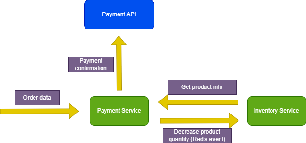

# FastAPI Microservices with Redis

This project aims to demonstrate the implementation of microservices architecture using FastAPI and Redis. It consists of two microservices - Inventory and Payment, and a frontend application.

## Running the Project

To run the project, use Docker Compose:

```
docker-compose up --build
```

## Microservices Endpoints

- **Inventory Microservice**: Running at [http://localhost:80/docs](http://localhost:80/docs)
- **Payment Microservice**: Running at [http://localhost:81/docs](http://localhost:81/docs)

## Frontend

The frontend application should be accessible at [http://localhost:3000](http://localhost:3000)

## Technologies Used

- Python
- FastAPI
- TypeScript
- React
- Redis Database
- Redis Streams
- Docker

## Functionality Diagram



This diagram illustrates the functionality of the application, showcasing the interaction between different components.